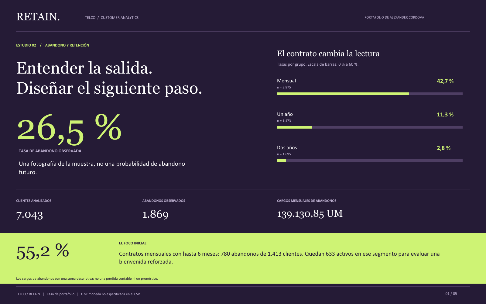
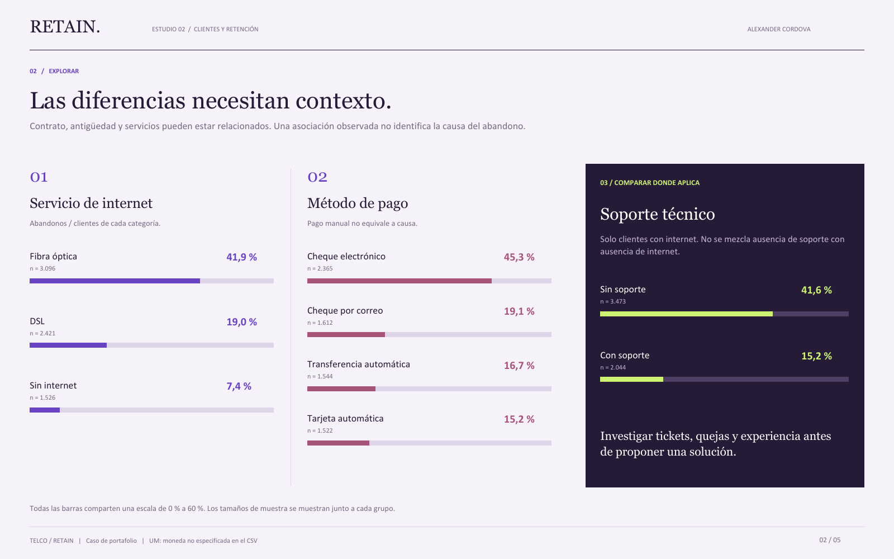
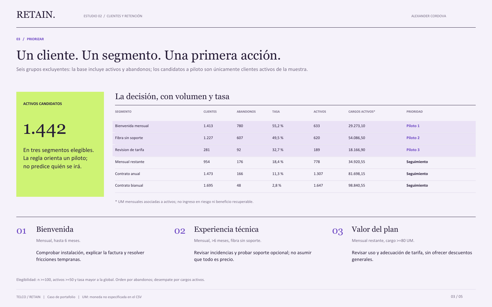

# RETAIN.

### Entender la salida. Diseñar el siguiente paso.

Análisis de abandono y propuesta de retención de clientes Telco con **Python · SQL/SQLite · Power BI**.



Caso de portafolio de Alexander Cordova. El objetivo es transformar una muestra de clientes en segmentos claros, hallazgos auditables y una propuesta de piloto medible. No es un encargo de un cliente real ni una campaña con resultados comerciales demostrados.

## Explorar el trabajo

| Entregable | Acceso |
|---|---|
| Proyecto completo: código, datos, SQLite, Power BI, pruebas y documentación | [Descargar ZIP completo](Telco_Retain_Proyecto_Completo.zip) |
| Resumen ejecutivo de cinco páginas | [Abrir PDF](Resumen_ejecutivo_retencion.pdf) |
| Limpieza y análisis reproducible | [src/analyze.py](src/analyze.py) |
| Esquema y once consultas de análisis | [Carpeta SQL](sql/) |
| Exploración explicada con código y resultados | [Notebook](notebooks/01_exploracion.ipynb) |
| Metodología, fuentes, diccionario y plan de retención | [Documentación](docs/) |

Los archivos sueltos son una selección navegable para revisar el trabajo. **Para ejecutar el proyecto o abrir Power BI, descarga y extrae el ZIP completo.** El ZIP mantiene todas las carpetas y los datos; no incluye cachés, entornos virtuales ni rutas personales.

## La pregunta de negocio

¿Dónde se concentra el abandono observado y qué grupos de clientes activos conviene investigar mediante un piloto de retención?

| Clientes analizados | Abandono observado | Activos candidatos a un piloto |
|---:|---:|---:|
| 7.043 | 26,54 % · 1.869 clientes | 1.442 |

Tres hallazgos:

- **El contrato cambia la lectura.** Abandono de 42,71 % en contratos mensuales, 11,27 % en anuales y 2,83 % en bianuales.
- **El inicio de la relación merece atención.** El segmento mensual con hasta seis meses de antigüedad presenta 55,20 % de abandono observado y conserva 633 clientes activos en la muestra.
- **La prioridad necesita una regla.** Se construyeron seis segmentos excluyentes y se seleccionaron tres grupos elegibles para investigar con un piloto. El listado de 1.442 activos no es una predicción individual de abandono.

## De los patrones a una propuesta



Las tasas describen asociaciones en la muestra, no prueban que el contrato, el método de pago o el soporte causen abandono. No se entrenó un modelo predictivo.



El plan propone acciones de bienvenida, diagnóstico técnico y revisión del valor del plan. La evaluación contempla un grupo de control. Los escenarios de mejora de 1, 3 y 5 puntos porcentuales son supuestos ilustrativos, no resultados conseguidos.

## Decisiones técnicas

- Preservar las 7.043 filas originales y validar la unicidad de `customerID` sin distinguir mayúsculas.
- Conservar los 11 `TotalCharges` vacíos como nulos; todos corresponden a `tenure=0`.
- Tratar `No internet service` y `No phone service` como categorías estructurales, no como datos faltantes.
- Conciliar importes mediante centavos enteros en Python y SQLite.
- Evitar sumar segmentos solapados y seleccionar candidatos únicamente entre clientes activos.
- Documentar denominadores, exclusiones y supuestos del piloto.

Los cargos se expresan en **UM**, unidad monetaria no especificada en el CSV. Los cargos asociados a quienes abandonaron no se presentan como pérdida contable ni ingresos futuros en riesgo.

## Power BI: qué incluye y cómo abrirlo

El ZIP contiene `powerbi/TelcoRetention.pbip`, sus carpetas `.Report` y `.SemanticModel`, medidas DAX y tres páginas: **Panorama, Factores y Prioridades**. Lee los CSV de `data/processed/`; SQLite es una vía independiente para auditar las mismas cifras.

1. Extrae el ZIP completo.
2. Configura `DataFolder` con tu carpeta `data/processed/`, usando el comando de abajo o los parámetros de Power BI.
3. Abre `powerbi/TelcoRetention.pbip` con Power BI Desktop compatible.
4. Actualiza y completa el [checklist nativo](docs/abrir_powerbi.md).

```powershell
python src/configure_data.py --folder "RUTA/telco-retention-analytics/data/processed"
```

**Estado:** estructura, referencias y controles locales verificados; carga, DAX, interacciones y apariencia en Power BI Desktop pendientes de revisión. Las imágenes de este repositorio proceden del PDF editorial, no son capturas de Power BI. No se entrega un PBIX validado.

## Reproducir el análisis

Python 3.10 o superior. Desde la carpeta `telco-retention-analytics` extraída del ZIP:

```powershell
python -m venv .venv
.\.venv\Scripts\python.exe -m pip install -r requirements.txt
.\.venv\Scripts\python.exe src/run_project.py --skip-powerbi
```

Este comando regenera el análisis, SQLite, el notebook y el PDF, y ejecuta las pruebas. No descarga datos. `--skip-powerbi` conserva el informe incluido; para regenerarlo, cierra Desktop, respalda cualquier edición manual y consulta el README del ZIP. Las imágenes PNG se exportan por separado del PDF.

**Verificación de esta entrega:** 20 pruebas aprobadas, conciliación Python/SQL y controles de estructura del PBIP. Los diez bloques de código del notebook incluyen salidas ejecutadas. La validación nativa de Power BI es una etapa distinta y sigue pendiente.

## Fuente, atribución y alcance

CSV de ejemplo del repositorio [IBM Telco Customer Churn](https://github.com/IBM/telco-customer-churn-on-icp4d/blob/master/data/Telco-Customer-Churn.csv). La copia de 970.457 bytes coincide por SHA-256 con la fuente pública, comprobado el 14 de septiembre de 2026. Se conserva el CSV original y la licencia Apache 2.0 del repositorio fuente; [atribución y transformaciones](docs/fuentes.md), [copia de licencia](docs/IBM-DATA-LICENSE.txt). No hay afiliación con IBM.

La licencia del dataset no se presenta como licencia del código propio. Proyecto desarrollado con asistencia de IA. Las decisiones, controles y limitaciones están documentados; no se atribuyen ahorros, recuperación de ingresos ni reducción del abandono a una campaña real.
